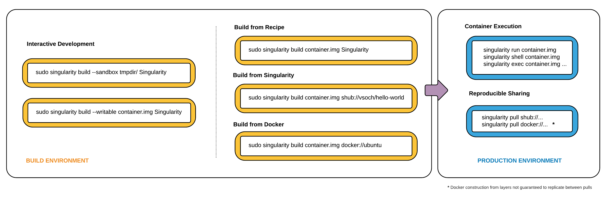

# singularity-chinese-doc
singularity中文使用手册

我是从17年3月份开始用的singularity，它是MIT和Berkeley的大牛们写的，当时的singularity只是一个不成熟的产品，我们CTO就洞察到了singularity前途无量，现在已经开始商业化了。然而从最开始到现在升级了几个版本，更新的内容太多，国内也是一点也找不到相关资料，爬过了这些坑，我决定把最常用的翻译成中文，希望对想要快速使用singularity的小伙伴们有点帮助。

`singularity`类似于`docker`，但是`singularity`比`docker`多了一些好处，[官方主页](http://singularity.lbl.gov/index.html)这样描述：

Singularity enables users to have full control of their environment. Singularity containers can be used to package entire scientific workflows, software and libraries, and even data. This means that you don’t have to ask your cluster admin to install anything for you - you can put it in a Singularity container and run. Did you already invest in Docker? The Singularity software can import your Docker images without having Docker installed or being a superuser. Need to share your code? Put it in a Singularity container and your collaborator won’t have to go through the pain of installing missing dependencies. Do you need to run a different operating system entirely? You can “swap out” the operating system on your host for a different one within a Singularity container. As the user, you are in control of the extent to which your container interacts with its host. There can be seamless integration, or little to no communication at all. What does your workflow look like?

简单来说就是有以下几个最主要的优点：

1、安全

​	完全可以不需要root用户，我们知道普通用户再docker使用的时候加一个 --user 0 和 -v 就可能看见普通用户看不到的一些文件

2、适合科学计算、深度学习

​	你要在docker里面运行tensorflow？ 跑起来效果怎么样？而singularity完全胜任这个工作，这是当初作者设计singularity的一个主要原因。而且目前最新的版本2.4，已经可以不用在singularity的image中安装nvidia驱动以及cuda等，只需要宿主机有就可以了。而docker的话。。。

3、docker的优点基本都有

​	大家都知道docker使用起来有多么的方便和好用，singularity在使用方便性上无限的向docker靠拢（然而最开始的时候还是啥都不支持的，那时候我是很嫌弃singularity的）。所以singularity学起来超轻松。在功能上，跟docker一样，统一环境，都是运行在容器中，使用起来不会因为换了一个环境而缺少依赖等等问题。singularity镜像制作和docker一样，可以方便的导入导出，可以自己build，singularity有自己的image仓库，还可以直接使用docker已经有的image等等等等